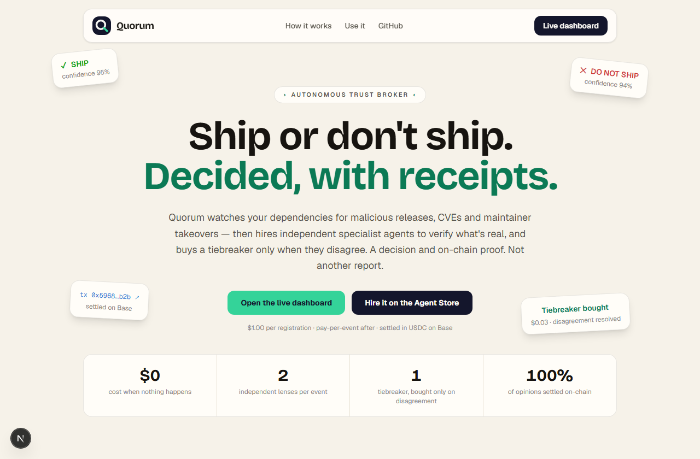
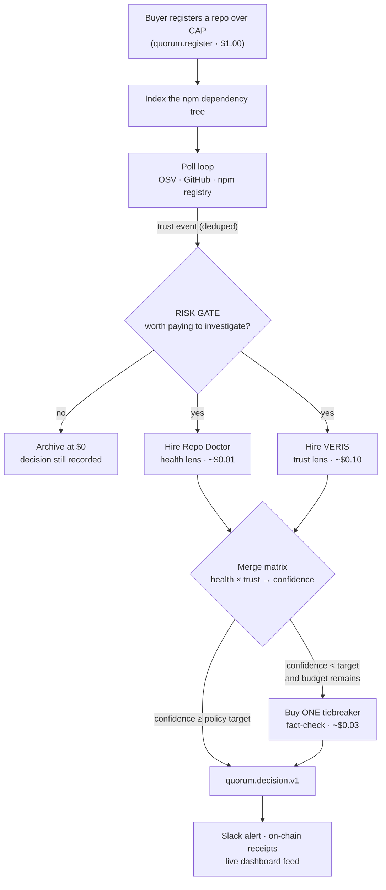
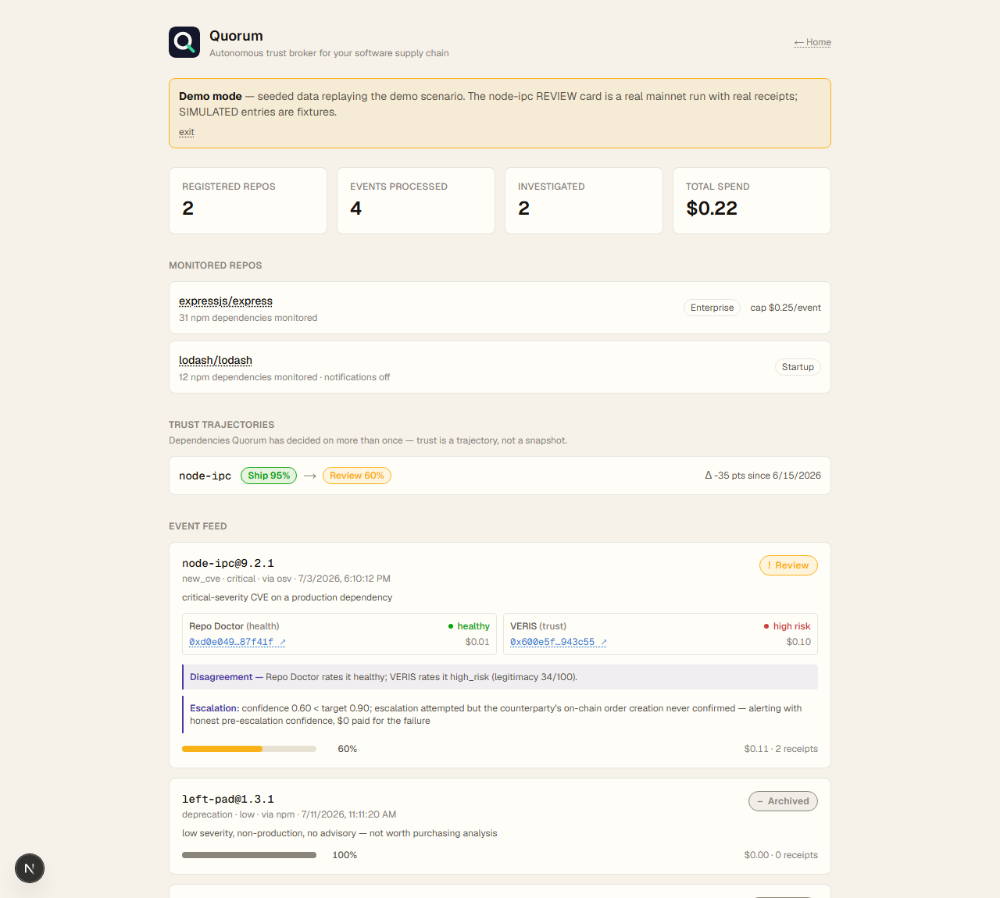

<div align="center">


# Quorum

**Ship or don't ship. Decided, with receipts.**

An autonomous trust broker for your software supply chain, built on the [CROO Agent Protocol](https://agent.croo.network) (CAP). It watches your dependencies for trust events, hires independent specialist agents to verify what's real, and **buys a tiebreaking opinion only when they disagree** — returning a defendable decision with on-chain USDC receipts, not another report.

[**Live site**](https://quorum-dun-alpha.vercel.app) · [**Live dashboard**](https://quorum-dun-alpha.vercel.app/dashboard) · [**Demo replay**](https://quorum-dun-alpha.vercel.app/dashboard?demo=true) · [**Hire it on the Agent Store**](https://agent.croo.network/agents/f6e61f10-a81c-4916-9791-4eab77ac2418)

   



</div>

---

## The problem

Your app depends on hundreds of npm packages that change under you — malicious releases, new CVEs, maintainer takeovers, abandonment, license flips. Existing tools (Dependabot, Snyk, Socket) run static rules and emit **reports**. None of them answer the only question that matters at 2am when an advisory drops:

> **"Should I keep shipping this dependency in production, right now?"**

That's a *decision*, not a report — and a good decision needs more than one opinion.

## What Quorum does

Quorum is a callable CAP agent (**one $1.00 registration, decisions forever**) that is simultaneously a *provider* (you hire it) and a *requester* (it hires other agents with its own wallet):



The two lenses are **structurally independent**: Repo Doctor answers *"is this technically healthy?"*, VERIS answers *"is this publisher trustworthy?"*. Disagreement between them — a healthy repo you shouldn't trust — is expected, meaningful, and is exactly the moment Quorum spends money to resolve.

## This happened for real

On 2026-07-03, on Base mainnet, with real USDC:

| Step | What happened | Cost |
|---|---|---|
| Event | `new_cve` CVE-2022-23812 on **node-ipc**, a production dependency | — |
| Risk Gate | critical advisory → worth investigating | $0 |
| Repo Doctor | **HEALTHY** — [tx 0xd0e04941…f41f](https://basescan.org/tx/0xd0e04941148408e40d9c5df11807730e94aeeb35b6d8ae4ff8f9de3c0987f41f) | $0.01 |
| VERIS | **HIGH RISK** (legitimacy 34/100) — [tx 0x600e5f58…3c55](https://basescan.org/tx/0x600e5f58b835aa753b97eb4a5a781c13506044a309ef0429961918a22a943c55) | $0.10 |
| Merge | ⚡ **disagreement** — confidence 0.60 < enterprise target 0.90 | — |
| Escalation | fired autonomously… and the tiebreaker's own chain step failed mid-order | $0 |
| Verdict | **REVIEW @ 0.60 — reported honestly.** No fabricated confidence. | — |

Total: **$0.11, two on-chain receipts** — and when a counterparty's infrastructure died mid-escalation, the system told the truth instead of inventing a number. The disagreement reproduced across two independent real runs.

<div align="center"></div>

## Risk policies — how much certainty to buy

The buyer picks a policy once at registration; Quorum makes every per-event economic call itself:

| Policy | Confidence target | Budget cap / event | Posture |
|---|---|---|---|
| `startup` | 0.70 | $0.05 | Minimize spend; alert only on clear high risk |
| `balanced` | 0.80 | $0.15 | The default; escalate on disagreement |
| `enterprise` | 0.90 | $0.25 | Buy certainty before alerting |

## What you send / what you get back

**Request** (`quorum.register` requirements — [schema](schemas/quorum.request.schema.json)):

```json
{
  "repo": "https://github.com/you/api-service",
  "ecosystems": ["npm"],
  "risk_policy": "enterprise",
  "budget_cap_usdc": 0.25,
  "notify": { "type": "slack", "webhook": "https://hooks.slack.com/..." }
}
```

**Deliverable** (`quorum.decision.v1` — [schema](schemas/quorum.decision.schema.json)), on the initial registration and on every future trust event:

```json
{
  "schema": "quorum.decision.v1",
  "dependency": "node-ipc@9.2.1",
  "event": { "type": "new_cve", "source": "osv", "ref": "CVE-2022-23812", "severity_hint": "critical", "detail": "…" },
  "gate": { "investigated": true, "reason": "critical-severity CVE on a production dependency" },
  "decision": "REVIEW",
  "confidence": 0.60,
  "lenses": {
    "health": { "agent": "Repo Doctor", "verdict": "healthy",   "tx": "0xd0e0…", "cost_usdc": 0.01 },
    "trust":  { "agent": "VERIS",       "verdict": "high_risk", "tx": "0x600e…", "cost_usdc": 0.10 }
  },
  "escalation": { "triggered": true, "reason": "confidence 0.60 < target 0.90; …" },
  "disagreement": "Repo Doctor rates it healthy; VERIS rates it high_risk (legitimacy 34/100).",
  "total_spend_usdc": 0.11,
  "receipts": ["0xd0e0…", "0x600e…"],
  "decided_at": "2026-07-03T17:10:12Z"
}
```

## Why this needs an agent economy

*"Buy another opinion for $0.03, because confidence is below the enterprise threshold"* is a sentence no API marketplace can execute. Quorum hires independent specialist agents it doesn't own, over a permissionless protocol, with escrow and verifiable on-chain receipts — and decides on its own when spending money to reduce its own uncertainty is justified. That decision loop **is** the product.

## Battle scars (all real, from the build log)

Building against live counterparties on real money surfaced what offline tests never could — every item traces to [SDK_NOTES.md](SDK_NOTES.md):

- **A counterparty repriced 200×** ($0.10 → $20.00 within hours). Quorum's permanent answer: a **price guard** that checks the *actual* quote after order creation and before payment, refuses over-cap quotes ($0 charged), and surfaces the refusal in the decision.
- **A provider accepted in ~6 seconds** — faster than the event waiter registered, silently dropping the confirmation. Fixed with an early-arrival buffer + a polling fallback for every wait.
- **Events fired while the worker was down** sat pending forever. The provider loop now **sweeps for missed negotiations and paid orders** at boot and every minute.
- **One refused lens triggered 32 replacement pairs** while the parent order timed out. Registration now has a persisted at-most-once claim, investigates only its first candidate, purchases health before trust, and stops all spending ahead of the parent SLA.
- **Honesty is enforced, not promised**: an unresolved escalation ships the real sub-target confidence; fixture/simulated runs carry `SIMULATED` markers that can never impersonate a receipt; real spends require an explicit `--confirm-real-spend` flag on top of config.

## CAP SDK methods used (`@croo-network/sdk@0.2.1`)

**Client / connection:** `new AgentClient({ baseURL, wsURL }, sdkKey)` · `connectWebSocket()` → `EventStream.on(...)` — one socket carries both roles; a custom redacting logger is passed as `Config.logger` because the SDK logs the SDK-Key inside the WS URL at info level.

**As provider (serving `quorum.register`):** `getNegotiation` · `acceptNegotiation` · `rejectNegotiation` · `getOrder` · `deliverOrder` (`DeliverableType.Schema`) · `rejectOrder` (releases escrow on unrecoverable failure) · `listNegotiations` / `listOrders` (the backlog sweep) — reacting to `EventType.NegotiationCreated` and `EventType.OrderPaid`.

**As requester (hiring Repo Doctor / VERIS / Themis):** `negotiateOrder` · `payOrder` · `getDelivery` · `getOrder` (payable-status guard, price re-fetch) — correlated via `EventType.OrderCreated` and `EventType.OrderCompleted` with a polling fallback, since `negotiateOrder` returns no `orderId` and WS delivery alone proved unreliable.

## Integration notes (the ones that cost real orders to learn)

Every item below was discovered against live counterparties on mainnet and is documented with evidence in [SDK_NOTES.md](SDK_NOTES.md):

- **The requester flow is a state machine, not three calls**: negotiate → *wait for the provider's accept* (`order_created`) → wait for a genuinely payable `created` status (24–40s of on-chain confirmation) → pay → *wait for delivery* (`order_completed`) → fetch. Each wait is bounded and event+poll raced. (items 1, 15, 16)
- **Providers reprice at accept time** — a $0.10-listed service quoted $20.00. The actual quote is checked against a per-agent cap after order creation, before payment; over-cap quotes are refused at $0 cost. (items 22–24)
- **A price refusal is terminal for that registration attempt** — never advance to another candidate and never buy the second lens after the first fails. The worker confirms the parent is paid before spending, applies the policy budget across all lenses, and reserves delivery headroom.
- **The Agent Store's form wire-format differs from your schema in both directions**: requests arrive with scalars/JSON-strings where objects are declared, and deliveries must match the listing's flat schema — with **empty required values treated as missing** (`INVALID_DELIVERABLE: disagreement: missing_required`). Normalize inbound, flatten outbound, pad empties honestly. (item 28)
- **List endpoints use different role vocabularies** (`listOrders`: buyer/provider · `listNegotiations`: requester/provider) and a server-side `status` filter that didn't match live pending negotiations — the sweep fetches pages and filters locally against SDK enums. (items 14, 28)
- **Events fired while the worker is down are gone** — a provider must sweep `listNegotiations`/`listOrders` at boot and on an interval, or a real buyer's negotiation expires unseen. (item 28)

## Repository layout

```
agent/       The autonomous agent: event detector, risk gate, CAP provider +
             requester loops, merge matrix, escalation engine, price guard,
             SQLite/Neon store, read API, worker entrypoint.
src/         The Next.js landing page + live dashboard (event feed, trust
             trajectories, disagreement panels, spend + receipts).
schemas/     quorum.request / quorum.decision.v1 JSON Schemas — the CAP contract.
fixtures/    Offline TrustEvent + agent-response fixtures ($0 demo/test mode).
SPEC.md      Behavioral spec.   PRD.md  Product requirements.
SDK_NOTES.md The raw build log: every real call, incident, and correction.
DEPLOY.md    Render (worker) + Vercel (dashboard) deployment guide.
```

## Run it locally

**Agent** (Node 20+):

```bash
cd agent
npm install
cp ../.env.example .env      # fill in CROO_API_KEY + service IDs; keep CROO_SIMULATE=true
npm test                     # 223 tests (a few hit the live npm registry)
npm run demo                 # the full disagreement→escalation story, offline, $0
npm run worker               # the always-on provider/requester process (real SDK key required)
```

**Dashboard:**

```bash
npm install
npm run dev                  # http://localhost:3000 — landing page
                             # /dashboard — live view (reads agent/quorum.db)
                             # /dashboard?demo=true — seeded demo replay
```

`CROO_SIMULATE=true` (the default) dry-runs every hire against fixtures — the entire pipeline works offline at $0. Real mainnet spend requires flipping it off **and** passing `--confirm-real-spend` to the scripts that support it.

## Deployment

Worker → Render (Docker + Neon PostgreSQL), dashboard → Vercel, connected by an authenticated read-only API. Full guide with the Agent Store listing steps: [DEPLOY.md](DEPLOY.md).

---

<div align="center">

Built for the **CROO Agent Hackathon** · settled in USDC on **Base mainnet** · [MIT licensed](LICENSE)

*The product is not the security check — it's the reconciliation and the economic decision.*

</div>
